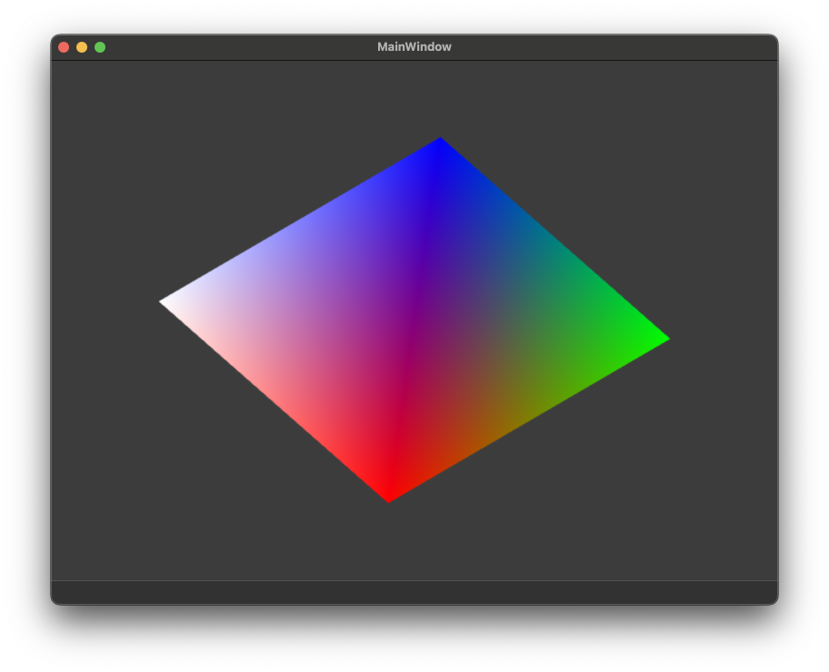

# qt-wgpu

<p align="center">

</p>

## What is this?

This is an example of integrating WebGPU into a Qt application using [google dawn](https://github.com/google/dawn). At least at the time of this writing, I could not find an example of combining Qt with WebGPU.

Disclaimers:
- This repository is only intended as sample code. I have implemented and tested support for Windows and OSX platforms against `Qt 6.9`.
- I have not yet tried Linux/wayland - this is a TODO for now (PRs are welcome).
- The dawn API is not yet stable, and upstream changes may break this in future.

## How does it work?

[`source/QWGPUWidget.cpp`](source/QWGPUWidget.cpp) implements a custom `QWidget` that instantiates a WGPU context and renders a simple demo pipeline. In order for this to work with Qt, we need to create a WGPU surface from the underlying OS representation.

The primary piece of the implementation is `CreateSurfaceDescriptor`. There needs to be an implementation of this method for every target platform:
- On Windows we can cast `QWidget::winId()` into an `HWND` handle and create a `wgpu::SurfaceSourceWindowsHWND`.
- Similarly on OSX, we can cast `QWidget::windId()` into an `NSView*` - see [`create_surface_descriptor.mm`](source/create_surface_descriptor.mm).

In addition, the widget needs to be created with attributes `Qt::WA_NativeWindow` and `Qt::WA_PaintOnScreen` so that rendering can be handled by WebGPU.

The rest of the files in the project are just wgpu utilities for the purpose of the demo.

Credit to Gilad Reich for their [QtDirect3D](https://github.com/giladreich/QtDirect3D) examples, which acted as a helpful reference.

## Building:

### Checkout git submodules:

[libfmt](https://github.com/fmtlib/fmt) and [magic_enum](https://github.com/Neargye/magic_enum) are used for printing to console.

```bash
git submodule update --init
```

### Checkout dawn:

For my use case I have found it easiest to build dawn from source as a CMake project subdirectory - that is how this example project is configured.

```bash
cd dependencies
git clone https://github.com/google/dawn.git dawn
cd dawn
git checkout v20250621.085109
python ./tools/fetch_dawn_dependencies.py
```

If you want to link to a pre-built dawn binary, you will need to modify the CMake. Elie Michel's [WebGPU tutorials](https://github.com/eliemichel/LearnWebGPU) may be useful to that end.

### Configure cmake:

```bash
mkdir build
cd build
cmake .. \
  -DCMAKE_BUILD_TYPE=RelWithDebInfo \
  -GNinja \
  -DCMAKE_PREFIX_PATH=...
```

`CMAKE_PREFIX_PATH` should be set to the install prefix for your chosen Qt version and platform. For example on OSX it might default to `~/Qt/6.9.1/macos`. On Windows it might be `C:\Qt\6.91\msvc2022_64`.

I have only tested this project using Ninja as the build-system, your mileage may vary.

### Build and run:

From the build directory:

```bash
cmake --build . -j8
./qt-wgpu
```
